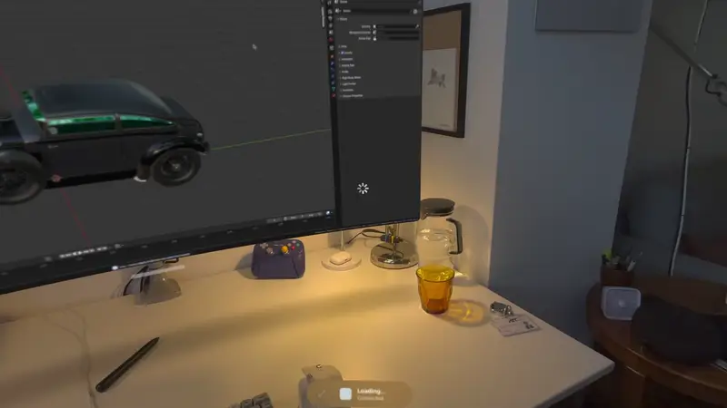
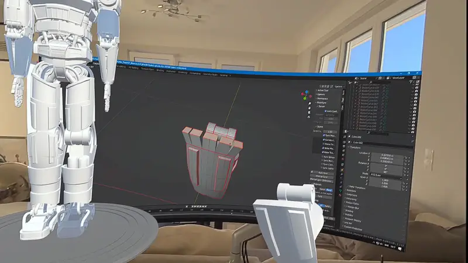

# BlenderSpatialPreview

Send the scene you have open in Blender to an Apple Vision Pro with one button. It goes
through Apple's Spatial Preview, so nothing has to be installed on the headset.

<p align="center">
  <a href="https://github.com/user-attachments/assets/45296a21-891e-4980-a34a-7f070f3b969a">
    
  </a>
</p>


Two parts: a Blender add-on and a small macOS app. The add-on exports and sends, the app
talks to the headset. The app's window has nothing to press.

One copy goes out per press. There is no live editing and no animation — what travels is
the scene as it stands at that moment, a single frame. Change something and press send
again.

## Status

This is a prototype and not a finished product. Treat it as such and expect bugs and rough
edges.

`SpatialPreview` and `USDKit` are new frameworks, both `@available(macOS 27.0)`, and the
APIs may still move.

| | |
|---|---|
| Mac | Apple Silicon, macOS 27 |
| Headset | Apple Vision Pro, visionOS 27 |
| Xcode | 27 — the frameworks ship in its SDK; not needed for the prebuilt app |
| Blender | tested on 5.2 LTS |

## Setup

### 1. Build the app

```bash
git clone https://github.com/AdrianDot/BlenderSpatialPreview.git
cd BlenderSpatialPreview
Bridge/build.sh
open Bridge/build/SpatialPreviewBridge.app
```

There is no Xcode project and you need no developer account: `build.sh` compiles the Swift
sources and the icon, ad-hoc signs the bundle and leaves it in `Bridge/build/`.

If it reports that `SpatialPreview.framework` is missing, the build is using the wrong
Xcode. Point it at one with the macOS 27 SDK, for this shell only:

```bash
export DEVELOPER_DIR=/Applications/Xcode.app/Contents/Developer
```

To change it for good instead: `sudo xcode-select -s /Applications/Xcode.app`.

macOS asks for local network permission on first launch; the app needs it to reach the
headset. Leave it running while you work. Quitting it also closes the preview on the
headset, which is deliberate — Apple allows only a few open sessions at a time.

#### Just want to try it? Skip the build

If you'd rather not install Xcode, `SpatialPreviewBridge.zip` in this repository holds a
ready-built copy of the app. Unzip it and open `SpatialPreviewBridge.app`.

The app isn't notarized — that takes a paid Apple developer account — so macOS will most
likely refuse to open it the first time. You have to force it open, one of two ways:

- Try to open the app once and dismiss the warning. Then go to System Settings → Privacy &
  Security, scroll down and press **Open Anyway** next to the line about
  SpatialPreviewBridge.
- Or remove the download flag macOS put on it, from Terminal:

  ```bash
  xattr -dr com.apple.quarantine /path/to/SpatialPreviewBridge.app
  ```

Only do this if you trust the source. If you'd rather not, build it yourself as above — it's
the same app. You still need an Apple Silicon Mac on macOS 27.

### 2. Install the Blender add-on

Preferences → Add-ons → the ∨ menu → **Install from Disk**, then pick
`Blender/spatial_preview_bridge.py` and tick **Spatial Preview Bridge**.

### 3. Send

In the 3D viewport sidebar (<kbd>N</kbd>) → **Spatial Preview** → **Send to Vision Pro**.

The first send raises Apple's device picker. Choose your Vision Pro and press **Send**
once more; a headset already connected to the Mac is used without asking, and the choice
lasts as long as the app runs.

**Close on Headset** takes the preview back down.

### What the sidebar tells you

It waits for the real answer from the headset rather than guessing.

| | | |
|---|---|---|
| 🟢 | **arrived** | the headset has it, with the payload size |
| 🔴 | **not arrived** | something stopped it, with a line naming what |
| 🟡 | **check the textures** | it arrived, but a texture may not resolve |
| 🟡 | **Scene changed since** | you edited something — send again |
| ⚪ | **closed** | you pressed Close on Headset |

## Limits

**Heavy models can arrive as a small placeholder cube.** One oversized object can take the
rest of the scene down with it. The exported file is correct in those cases, so it happens
inside Apple's processing — and it may not be a vertex count at all. The optimizer is a
black box, and the limit could depend on the geometry, the textures or the memory free on
the device at that moment.

- A Decimate modifier on the offending object is the practical answer.
- Blender shows a yellow notice when a scene is heavier than anything this was tested on.

**Blender freezes while a send is in flight.** It is waiting for the headset's answer, not
stuck, and it always comes back. Apple loads in stages, so a scene still arriving can look
like it is missing objects; the app's window shows that progress.

**No live editing and no animation.** Live editing was built and removed: Blender's USD
exporter writes no transform for an object at its rest position, so moving it changes
nothing on the headset and reports no error, and past a few hundred thousand vertices live
updates stop replicating silently. Plain sending is unaffected.

**Apple Vision Pro only.** Spatial Preview is Apple's, so there is no Quest or Android path
here. Real-time mesh streaming and Quest support are a separate project of mine — I post
about it at [@Adrian_Schr](https://x.com/Adrian_Schr).

<p align="center">
  <a href="https://github.com/user-attachments/assets/7cea091f-3d6c-4109-b5c4-5d0920e2f190">
    
  </a>
</p>


## How it works

```
  Blender                    macOS app                       Apple Vision Pro
 ┌──────────────────┐       ┌──────────────────────┐        ┌─────────────────┐
 │ add-on exports   │       │ opens the file with  │        │ Spatial Preview │
 │ the scene to USD │──────▶│ USDKit, hands it to  │───────▶│ draws the scene │
 │                  │socket │ USDPreviewSession    │  Apple │                 │
 │ waits for the    │◀──────│ reports what the     │        │                 │
 │ answer           │       │ headset did with it  │        │                 │
 └──────────────────┘       └──────────────────────┘        └─────────────────┘
```

Apple has no update call: it watches the USD file and replicates it to the headset itself.
Scenes go out through its optimizer and compressor, which is what lets heavy ones travel.
There is no switch for that.

Everything is driven from Blender. The app reports what the Mac half did and shows Apple's
device picker the first time; you can leave its window closed.

| | |
|---|---|
| Materials and textures | colour, normal, roughness, metallic |
| Real-time editing | no — press send again |
| Animation | no — the current frame only |
| Edits made on the headset coming back to Blender | no |

## License

MIT.
